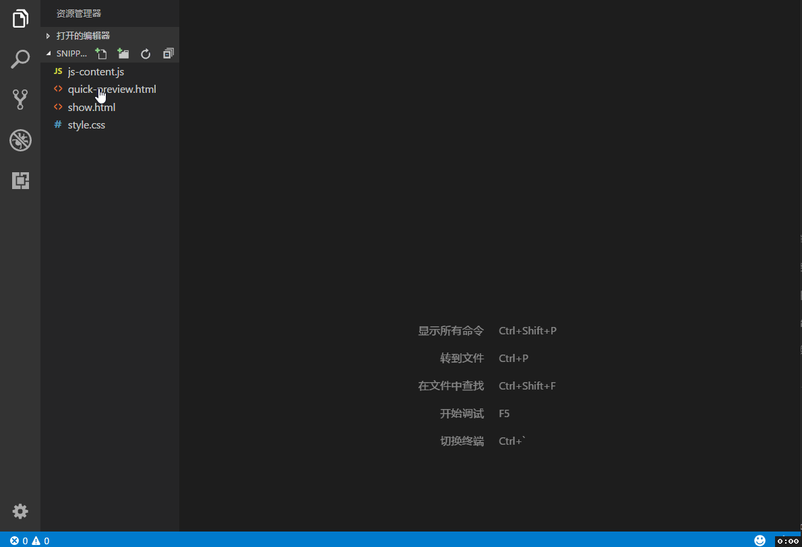

# Quick HTML Previewer
This extension allows you to preview your html files in VS Code itself. Use it to quickly set the html, css and javascript right for your webpages.
### Features
#### Side preview with quick editing

#### Full page preview
### Usage
* For side preview, use the keybinding 'ctrl+q s' or press 'F1' and type "Side preview"
* For full preview, use the keybinding 'ctrl+q f' or press 'F1' and type "Full preview"

If a HTML file is open, a message is displayed on the Status Bar in bottom left. Click on it for side preview.